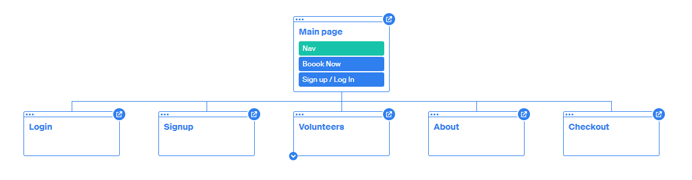
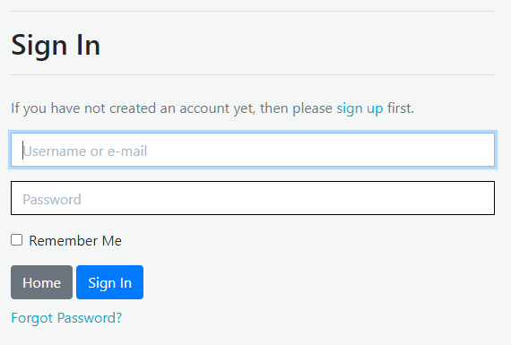
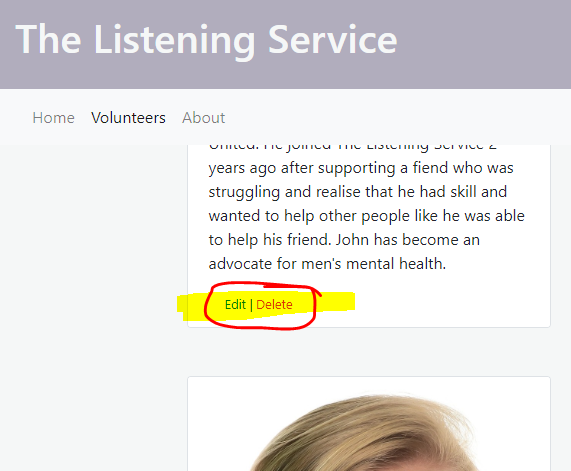
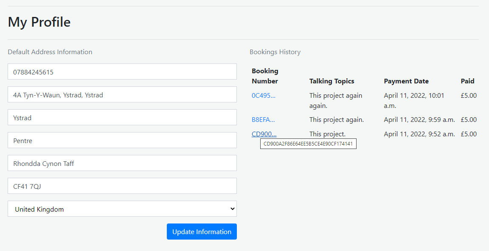
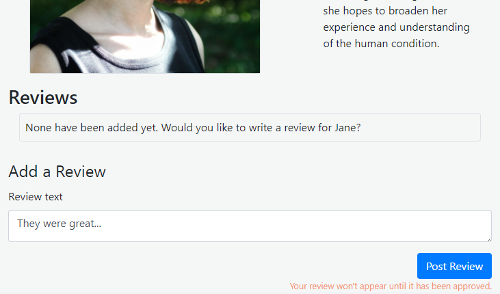

# The Listening Service

A website that allows users to access a mental health wellbeing scheme where they can request to arrange a booking with a volunteer listener.

**The live project is available on Heroku: [The Listening Service](https://the-listening-service.herokuapp.com)**


## Table of Contents
- [User Experience Design](#user-experience-design)
  * [Strategy](#strategy)
  * [Scope](#scope)
    + [User Stories](#user-stories)
  * [Structure](#structure)
  * [Skeleton](#skeleton)
	+ [Database Design](#database-design)
    + [Sitemap](#sitemap)
  * [Surface](#surface)
- [Features](#features)
  * [Current Features](#current-features)
  * [Future Features](#future-features)
- [Technologies Used](#technologies-used)
  * [Languages](#languages)
  * [Libraries](#libraries)
  * [Frameworks](#frameworks)
  * [Other Services and Software](#other-services-and-software)
- [Testing](#testing)
- [Deployment Instructions](#deployment-instructions)
- [Acknowledgements](#acknowledgements)
  * [Content](#content)
  * [Media](#media)
  * [Thanks](#thanks)

## User Experience Design


### Strategy

*The Listening Service*'s aim is to bring together people who could benefit from having a stranger to talk to and volunteers who are willing to give their time and "lend an ear" to people accessing the service.
Value is to be obtained by:
- Promoting the healthy practice of talking through issues.
- Connecting well intentioned individuals to generate healthy social participation.
- Providing a point of access for those in need of someone to listen.

### Scope

To achieve these aims the project will offer a booking system whereby users will be able to make a formal request (via payment) that is passed to a database to enable the behind the scenes team to track and manage bookings with volunteers and users. Booking reference emails and booking history will allow users to monitor the request that they've made and money they have spent using the service.

#### User Stories

| Scenario | Requirements  |
|----------|---------------|
| **As a potential user**, I want to know what the service offers and how much it costs. | There should be an easy to access About page with the information required stated clearly. |
| I want to see who is involved. | A page to show the currently active volunteers with the project to provide users with an understanding of who they might be talking to. |
| I want sign up before I start placing bookings | Prompts and links to sign up to be displayed prominently. |
| **As a returning user**, I want to be able to access a history of my activity | A profile page with a list of prior booking requests. |
| I want the process to be quicker and easier than if I weren't signed up.  | Pre filled booking form using data provided by the user. |
| I want to be able to provide feedback. | The ability to leave reviews. |
| **As a site admin**, I want to be able to update the volunteers shown to users. | The ability to add, update and remove volunteers from the site. |
| I want to only allow appropriate user submitted information to display on the site | A system whereby reviews do not appear publicly unless approved by an admin. |

### Structure

The project will make use of django models, templates and views to structure the database, webpages and logic for the site. Information will be presented to the users via linked webpages, information collected via forms, and information stored using django models that can be accessed via the django admin interface.
All areas that users will need to access will be accessible by initiating a route into a process from the main navigation at the top of the webpage. Public information will be via a main navigation bar, while user specific information will be via a separate UserAccount menu.

### Skeleton

There will be 4 main models to handle data to be stored (excluding those provided from the framework itself or specific additional libraries or frameworks)

1. UserProfile  
Contains the user address information to speed up booking when the user is logged in.
2. Review  
Contains reviews submitted by users for specific volunteers.
3. Volunteer  
Contains the information about the volunteers to display on the site.
4. Order
Contains the booking information to be able to feedback to admin and user the details of the booking request made. 

Authentication will be handled by [allauth](https://django-allauth.readthedocs.io/).

There will be specific relationships between some of these:
1. Orders will be linked to specific Users
2. Reviews will be linked to both a specific user who submitted the review as well as the volunteer that the review belongs to.

#### Database Design


The navigation menu will appear differently depending on if a user is logged in or not.

_Main Nav_
| Menu Item | Not Logged In | Logged In | Logged In Superuser |
|----------|---------------|---------------|---------------|
| Home | :heavy_check_mark: | :heavy_check_mark: | :heavy_check_mark: |
| Volunteers | :heavy_check_mark: | :heavy_check_mark: | :heavy_check_mark: |
| About | :heavy_check_mark: | :heavy_check_mark: | :heavy_check_mark: |

_My Account_
| Menu Item | Not Logged In | Logged In | Logged In Superuser |
|----------|---------------|---------------|---------------|
| Add a Volunteer | :x: | :x:  | :heavy_check_mark: |
| My Profile | :x: | :heavy_check_mark: | :heavy_check_mark: |
| Register | :heavy_check_mark: | :x: | :x: |
| Log In | :heavy_check_mark: | :x: | :x: |
| Log Out | :x: | :heavy_check_mark: | :heavy_check_mark: |

#### Sitemap



The above sitemap shows the navigation possibilities for a non-logged-in user only.
Many more paths and possibilities become available to a logged in user such as the Profile. Even more for a superuser with e ability to add and edit pages for the volunteers for example.


### Surface

Choices for the visual style of the project are to be clean and clear to instil confidence in the user that the service is professional and crate trust in both taking payments and the the service that will be provided is of quality. Minimal clutter in order to highlight the straight ford nature of the service offered and to draw the most attention to the primary buttons to progress though the site to make a booking request. These primary buttons are to stand out against the background so that users are drawn to them.


## Features

Primarily the project allows users the ability to make payments via Stripe to secure a booking with a volunteer to share some time and space to communicate, for the purposes of improving mental wellbeing. Users can also store personal details to speed up payments in the future as well as see a personal history of booking requests made.
Admin can control the review content left by users for volunteers as well as manage the volunteer records themselves and therefore what content appears on the volunteers page.

### Current Features
These features have been implemented in the project.

 - Register & Login Functionality
	 * Through a combination of allauth functionality and conditional logic in either the views or templates, certain areas of the website and menu items are not accessible to users unless they have created an account and logged in.
	 * Only superusers have access to edit and delete volunteers and approve reviews submitted. As well as editing or deleting volunteer records.
	 



 - Profile
	 * Only accessible to logged in users.
	 * Users can update their default address details that are used for payments.
	 * Users can view their previous booking history.
	 


 - Leave Reviews
	 * Users can search for the volunteer that they talked to and then leave a review for that user.
	 * Admin can approve reviews. They are prevented from appearing until they are approved.
	 


 - Stripe
	 * Secure payments via Stripe payments service.
	 * Redundancy features to ensure orders are saved via Stripe webhooks even if checkout form fails to submit.


### Future Features
Possible features to be considered for future releases.
 - Volunteer access
	 * The ability for volunteers to log in and control their own volunteer record.

 - Links between bookings and volunteers
	 * Rather than having the booking process handled outside of the project scope, it be included with specific functionality to connect users to volunteers 
	 * and record and display that information.

 - Donations
	 * The ability to increase the payment amount to include a discretionary donation.
 

## Technologies Used
### Languages
 - HTML 
 - CSS
 - JavaScript
 - Python

### Libraries
 - [jQuery](https://jquery.com/)
 
### Frameworks
 - [Django](https://www.djangoproject.com/)
	 - To build web app
 - [Bootstrap](https://getbootstrap.com/)
	 - For pre-defined HTML and CSS.

### Other Services and Software
 - [Dependencies](https://github.com/llewelyn-williams/the-listening-service/network/dependencies)
 - Git
 	 - Version control.
 - GitHub
 	 - Cloud-based storage and deployment via GitHub Pages.
 - GitPod
 	 - IDE.
 - [StackEdit](https://stackedit.io)
	 - Used to assist in the planning and creation of this README markdown file.
 - [markdown-toc](https://ecotrust-canada.github.io/markdown-toc)
	 - Used to generate table of contents in markdown for this README markdown file.
 - [Moon Modeler](https://www.datensen.com/data-modeling/moon-modeler-for-databases.html)
	 - For creating the database diagram.
 - [Octopus.do](https://octopus.do/)
	 - For Sitemap
 - [FontAwesome](https://fontawesome.com/)
	 - For icons.
 - [Heroku](https://heroku.com)
	 - For deploying the live app.


## Testing

See separate [TESTING.md](TESTING.md)


## Deployment Instructions

Forking a Repository
1. Navigate to GitHub Repository
2. Use the **Fork** link (node tree icon) from the top right of the page just under the header.
3. You now have a copy of the repository among your own.

[Further Instruction](https://help.github.com/articles/fork-a-repo)

Cloning a Repository
1. Navigate to GitHub Repository
2. Use the **Code** dropdown button from just above the repository on the right.
3. Copy the relevant address or command to use as instructed with your chosen method.
4. For example in Git Bash use the command `$ git clone https://github.com/`**github-username**`/`**repository-name**
5. You now have a local copy of the Repository in the directory where you ran the command.

[Further Instruction](https://help.github.com/articles/cloning-a-repository/)

Requirements

This app has dependencies listed in the requirements.txt included.
This project was built in an environment using Python3, therefore it is likely you will need to use the same version.

Install the dependencies all together using the requirements.txt by using the command `pip3 install -r requirements.txt` from the CLI of your IDE.

This project uses environment variables not included in the repository. These will need to be set locally for development purposes and also in the deployed environment. You will need to pay attention to the following settings in the project main django app `settings.py` file and set them appropriately in your environments:
```
SECRET_KEY = os.environ.get('SECRET_KEY', '')
DEBUG = 'DEVELOPMENT' in os.environ


# DATABASE_URL will come from Postgres that you will need in your Heroku app (available under the resources tab)

if 'DATABASE_URL' in os.environ:
    DATABASES = {
        'default': dj_database_url.parse(os.environ.get('DATABASE_URL'))
    }
else:
    DATABASES = {
        'default': {
            'ENGINE': 'django.db.backends.sqlite3',
            'NAME': os.path.join(BASE_DIR, 'db.sqlite3'),
        }
    }


# You will need an Amazon Web Service Bucket configured with public access
# Keys and names for this will be available from AWS.

# Bucket Config
AWS_STORAGE_BUCKET_NAME = 'the-listening-service'
AWS_S3_REGION_NAME = 'eu-west-2'
AWS_ACCESS_KEY_ID = os.environ.get('AWS_ACCESS_KEY_ID')
AWS_SECRET_ACCESS_KEY = os.environ.get('AWS_SECRET_ACCESS_KEY')
AWS_S3_CUSTOM_DOMAIN = f'{AWS_STORAGE_BUCKET_NAME}.s3.amazonaws.com'


#You will need a Stripe account. Keys will be available from there.
#You will also need to activate a webhook from within Stripe with all services
#directed to your deployed app address /checkout/wh/
#The WH key will be available from there.

# Stripe
STRIPE_CURRENCY = 'gbp'
STRIPE_PUBLIC_KEY = os.getenv('STRIPE_PUBLIC_KEY', '')
STRIPE_SECRET_KEY = os.getenv('STRIPE_SECRET_KEY', '')
STRIPE_WH_SECRET = os.getenv('STRIPE_WH_SECRET', '')


#Set DEVELOPMENT to True in your development environment, and not in you deployed environment
# Email pass and user can be obtained by enabling app access to a gmail account
# This is possible from the security tab once 2-factor authentication has been enabled.
if 'DEVELOPMENT' in os.environ:
    EMAIL_BACKEND = 'django.core.mail.backends.console.EmailBackend'
    DEFAULT_FROM_EMAIL = 'TheListeningService@example.com'
else:
    EMAIL_BACKEND = 'django.core.mail.backends.smtp.EmailBackend'
    EMAIL_USE_TLS = True
    EMAIL_PORT = 587
    EMAIL_HOST = 'smtp.gmail.com'
    EMAIL_HOST_USER = os.environ.get('EMAIL_HOST_USER')
    EMAIL_HOST_PASSWORD = os.environ.get('EMAIL_HOST_PASS')
    DEFAULT_FROM_EMAIL = os.environ.get('EMAIL_HOST_USER')
```


Live deployment of this project via Heroku has three main requirements:
1. The included Procfile needs to be present 
2. Correct environment variables as detailed above need to be entered into the **Config Vars** area of the **Settings** in the project that you will need to create on [Heroku](https://heroku.com)
3. The project needs to be deployed, for this I recommend linking your GitHub repository containing the project using the **GitHub** option from the **Deployment method** section under the **Deploy** tab of your Heroku project. Then enable **Automatic deploys**


## Acknowledgements

### Content

Vigorous use of components and classes from [Bootstrap](https://getbootstrap.com/).

Basis for Django project and therefore much code and no-media image:
- [Code Institute's Boutique Ado - Educational Project](https://github.com/Code-Institute-Solutions/boutique_ado_v1/)

Other sources referenced inline.

### Media

 - Mockups Screenshot from [Am I Responsive](http://ami.responsivedesign.is/)
 - Volunteer Profile Images
	- [volunteer1](https://pixabay.com/photos/man-portrait-adult-young-men-4568762/)
	- [volunteer2](https://pixabay.com/photos/woman-model-smile-joy-beauty-6126481/)
	- [volunteer3](https://pixabay.com/photos/female-amye-headshot-hair-lady-4572747/)
	- [volunteer4](https://pixabay.com/photos/woman-portrait-headshot-female-4525646/)
	- [volunteer5](https://pixabay.com/photos/woman-white-headshot-blonde-female-1460150/)


### Thanks

 - Code Institute
 - My Code Institute Mentor
 - My Long Suffering Partner