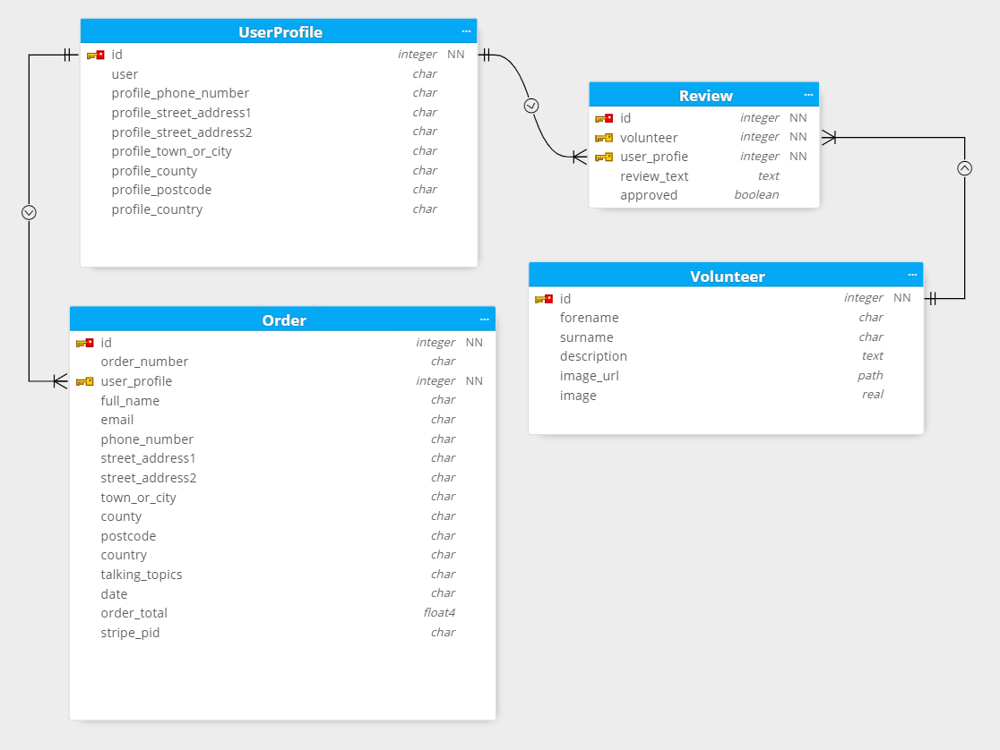

# The Listening Service

Project Description

**The live project is available on Heroku: [The Listening Service](https://the-listening-service.herokuapp.com)**


## Table of Contents
- [User Experience Design](#user-experience-design)
  * [Strategy](#strategy)
  * [Scope](#scope)
    + [User Stories](#user-stories)
  * [Structure](#structure)
  * [Skeleton](#skeleton)
	+ [Database Design](#database-design)
    + [Sitemap](#sitemap)
    + [Wireframes](#wireframes)
  * [Surface](#surface)
- [Features](#features)
  * [Current Features](#current-features)
  * [Future Features](#future-features)
- [Technologies Used](#technologies-used)
  * [Languages](#languages)
  * [Libraries](#libraries)
  * [Frameworks](#frameworks)
  * [Other Services and Software](#other-services-and-software)
- [Testing](#testing)
- [Deployment Instructions](#deployment-instructions)
- [Acknowledgements](#acknowledgements)
  * [Content](#content)
  * [Media](#media)
  * [Thanks](#thanks)

## User Experience Design


### Strategy

*The Listening Service*'s aim is ...
Value is to be obtained by:
- ...
- ...


Details...

### Scope

The project will make use of ...

#### User Stories

| Scenario | Requirements  |
|----------|---------------|
| **As ...**, I want .... | There should be ... |
| I want ... | The content ...|
| I want ... | A way for the user to ...|
| **As ...**, I want ... | The ability to ... |
| I want ...  | The ...|
| I want ... | To provide ...|
| **As ...**, I want to be able to ... | ... |
| I want to ... | A ...|
| I want to ... | ...|

### Structure

The project will make use of ..
Information will be presented across web pages and data collected using forms ..

### Skeleton

...

#### Database Design



...

The navigation menu will appear differently depending on if a user is logged in or not.
| Menu Item | Not Logged In | Logged In |
|----------|---------------|---------------|
| Home | :heavy_check_mark: | :heavy_check_mark: |
| ... | :heavy_check_mark: | :heavy_check_mark: |
| ... | :heavy_check_mark: (redirects to Log In) | :heavy_check_mark: |
| ... | :heavy_check_mark: (redirects to Log In) | :heavy_check_mark: |
| Profile | :x: | :heavy_check_mark: |
| Sign Up | :heavy_check_mark: | :x: |
| Log In | :heavy_check_mark: | :x: |
| Log Out | :x: | :heavy_check_mark: |

#### Sitemap


#### Wireframes

Wireframes showing layout plans.


### Surface

Choices for the visual style of the project are ...


## Features

The project allows users the ability to ...

### Current Features
These features have been implemented in the project.

 - Register & Login Functionality
	 * Certain areas of the website and menu items are not accessible to users unless they have created an account and logged in.
	 * ...
	 


 - ...
	 * ...
	 * ...
	 


 - ...
	 * ...
	 * ...
	 


 - ...
	 * ...
	 * ...


 - ...
	 * ...
	 * ...
	 


 - ...
	 * ...
	 * ...


 - ...
	 * ...
	 * ...


### Future Features
Possible features to be considered for future releases.
 - ...
	 * ...
	 * ...

 - ...
	 * ...
	 * ...

 - ...
	 * ...
	 * ...
 
 - ...
	 * ...
	 * ...

 - ...
	 * ...
	 * ...


## Technologies Used
### Languages
 - HTML 
 - CSS
 - JavaScript
 - Python

### Libraries
 - [jQuery](https://jquery.com/)
 - [Link](#)
 
### Frameworks
 - [Link](#)
	 - ...
 - [Link](#)
	 - ...

### Other Services and Software
 - Git
 	 - Version control.
 - GitHub
 	 - Cloud-based storage and deployment via GitHub Pages.
 - GitPod
 	 - IDE.
 - [StackEdit](https://stackedit.io)
	 - Used to assist in the planning and creation of this README markdown file.
 - [markdown-toc](https://ecotrust-canada.github.io/markdown-toc)
	 - Used to generate table of contents in markdown for this README markdown file.
 - [Moon Modeler](https://www.datensen.com/data-modeling/moon-modeler-for-databases.html)
	 - For creating the database diagram.
 - [Link](#)
	 - ...
 - [FontAwesome](https://fontawesome.com/)
	 - For icons.
 - [GoogleFonts](https://fonts.google.com/)
	 - Fonts.
 - [Heroku](https://heroku.com)
	 - For deploying the live app.


## Testing

See separate [TESTING.md](TESTING.md)


## Deployment Instructions

Forking a Repository
1. Navigate to GitHub Repository
2. Use the **Fork** link (node tree icon) from the top right of the page just under the header.
3. You now have a copy of the repository among your own.

[Further Instruction](https://help.github.com/articles/fork-a-repo)

Cloning a Repository
1. Navigate to GitHub Repository
2. Use the **Code** dropdown button from just above the repository on the right.
3. Copy the relevant address or command to use as instructed with your chosen method.
4. For example in Git Bash use the command `$ git clone https://github.com/`**github-username**`/`**repository-name**
5. You now have a local copy of the Repository in the directory where you ran the command.

[Further Instruction](https://help.github.com/articles/cloning-a-repository/)

Requirements

This app has dependencies listed in the requirements.txt included.
This project was built in an environment using Python3, therefore it is likely you will need to use the same version.

Install the dependencies all together using the requirements.txt by using the command `pip3 install -r requirements.txt` from the CLI of your IDE.

This project uses environment variables not included in the repository. To set these locally create an `env.py` file and include the following:
```
import os

os.environ.setdefault("IP", "0.0.0.0")
os.environ.setdefault("PORT", "5000")
os.environ.setdefault("SECRET_KEY", "YOUR_SECRET KEY - can be anything")
os.environ.setdefault("MONGO_URI", "YOUR_MONGODB_URI")
os.environ.setdefault("MONGO_DBNAME", "YOUR_DATABSE_NAME")
```

You will need a database with [MongoDB](https://mongodb.com/) designed with the same schema [pictured above](#database-design). From the database you crete with MongoDB's you can get the `MONGO_URI` and `MONGO_DBNAME` values that you need frm MongoDB's connection guide.

Live deployment of this project via Heroku has three main requirements:
1. The included Procfile needs to be present 
2. The same environment variables from above need to be entered into the **Config Vars** area of the **Settings** in the project that you will need to create on [Heroku](https://heroku.com)
3. The project needs to be deployed, for this I recommend linking your GitHub repository containing the project using the **GitHub** option from the **Deployment method** section under the **Deploy** tab of your Heroku project. Then enable **Automatic deploys**


## Acknowledgements

### Content

Vigorous use of components and classes from Bootstrap.
[Bootstrap](https://getbootstrap.com/)

 Used for referencing:
 - [W3 Schools](https://www.w3schools.com/)
 - [Link](#)

### Media

 - Mockups Screenshot from [Am I Responsive](http://ami.responsivedesign.is/)


### Thanks

 - Code Institute
 - My Code Institute Mentor
 - My Long Suffering Partner