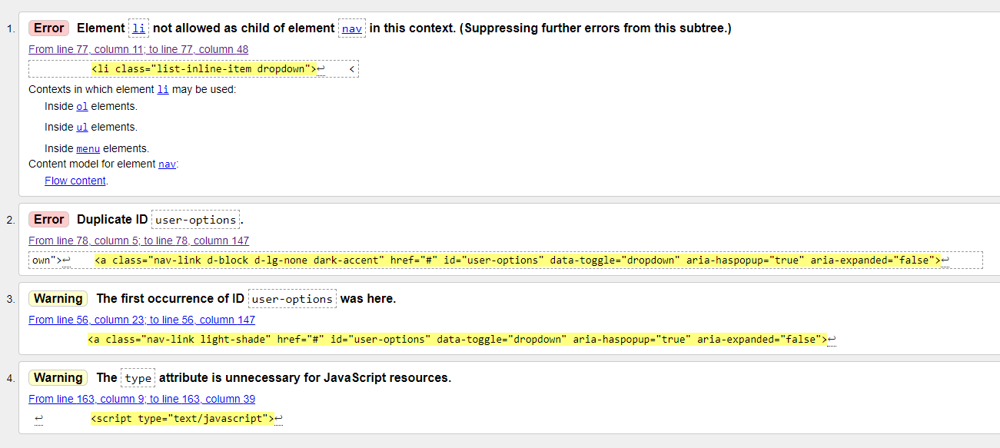
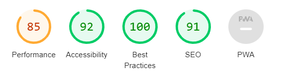

# Testing

## PEP8 Standard Linters
### Expected
The code is expected to pass without any major issues highlighted.
### Test
python3 -m flake8 command run to see flake8 error warnings
### Result
Frequent checking throughout development revealed many training whitespaces, missing newlines, extra newlines and lines too long that were fixed along the way.
At the end of the project the only errors showing were ones from code that was not written my myself, so they were left as they were in case they were deliberately that way for a reason.

## WC3 Markup Validation 
### Expected
The site is expected to pass validation with no errors.
### Test
I supplied the Live Heroku address of the site to [The WC3 Markup Validation Service](https://validator.w3.org/) and ran the test.
### Result
  
THe first error I attempted to fix by enclosing the li tag within ul tags, however this piece of code being a bootstrap component, doing so broke the functionality of it.
The second error of duplicate id is related to using different navigation for different size screens.
### Fix
Renaming one of the duplicate ids.
### Unresolved
As the first bakes the functionality it will be left for now until a solution can be found that removes the error but doesn't break the functionality.

## Responsiveness
### Expected
Throughout the different sections the design should remain well laid out regardless of the device size
### Test
Using Google Developer Tools I changed to each device available to see how the layout out looked, as well as using the "responsive" layout and changing the shape and size of the viewport with the drag handles. I did this repeatedly during the development process and again at the end.
### Result
The pages changed to a satisfactory layout for each different size.

## Functionality
### Expected
That the user will be able to navigate and perform CRUD actions without experiencing errors.
### Test
Logged in as super user and created, edited and deleted test volunteers.
### Result
Behaviour was as expected.

  
## Performance
### Expected
For the site to load quickly.
### Test
Using Lighthouse from Chrome Developer tools.
### Result
All issues affecting performance were from included CSS or JS libraries.
### Unresolved
A solution would be to remove the unused portions of the includes, however it is not practical therefore the amount of reduced performance will be a compromise for using those libraries.
 
 
## Accessibility
### Expected
The site should not have any major accessibility issues as shown by accessibility tests.
### Test
Using Lighthouse from Chrome Developer tools.
### Result
There were three issues.
1. A few parts of low contrast
2. The li issue that was picked up by the HTML Validator
3. Non-sequentially descending headings.
### Unresolved
1. The contrast level was not _the worst_ and unfortunately time is now an issue so contrast not increased, although this is possible by changing colours used.
2. For the same reasons as above this will not be fixed right now.
3. While it has given this warning, there are none that are completely out of order, it is only that some headings have been kipped in some areas.
 
## SEO
### Expected
No major issues to show from SEO report.
### Test
Using Lighthouse from Chrome Developer tools, I ran a report.
### Result
Missing meta description.
### Unresolved
Time limited, but can be fixed by including one.
 
## Usability
### Expected
That users should be able to use the site intuitively 
### Test
Throughout development I checked the navigation pathways throughout site.
### Result
Behaviour was as expected, I could get to where I expected to go by clicking on the links.
There was several points where I noticed that there could be more feedback to the user, so I added in extras to make things clearer, such as the search results display for the volunteers. Without this is was a little unclear that you were looking at a page that was the result of a search and therefore only showing filtered results.